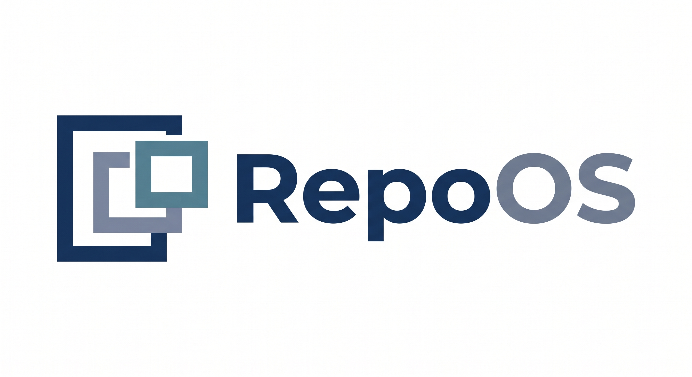

<div align="center">
  
</div>

<h3 align="center">
RepoOS is an AI-driven, formally verified compiler toolchain that bridges Python logic into high-performance native machine code via MLIR (Multi-Level Intermediate Representation).
</h3>

[](#)
[](#)

## Usage

You can test the RepoOS drop-in compiler and benchmarking tool on our bundled applications (e.g., `revenue_app`) with a single command. 

Provide the database credentials and target table via environment variables so the Oracle can infer the schema dynamically, then run the compiler:

```bash
./repoos.sh revenue_app/main.py revenue_app.main.get_revenue
```

To run a performance comparison of the original Python code against the compiled RepoOS zero-overhead L7 interceptor kernel (e.g., for 100 iterations):

```bash
./benchmark.sh revenue_app/main.py revenue_app.main.get_revenue 100
```

**Example Output:**
```text
--- 🚀 RepoOS A/B Benchmark Tool ---
Target Script: revenue_app/main.py
Track Mode:    standard
-------------------------------------
   [Bench] Running NATIVE...
   [Bench] Running REPOOS...

================================================================================
📊 PURE EXECUTION BENCHMARK: revenue_app/main.py
================================================================================
Metric               | Native          | RepoOS          | Gain/Diff
--------------------------------------------------------------------------------
Exec Time (ms)       |         37.7511 |         18.7297 | 2.02x
Peak Memory (MB)     |           94.77 |          102.30 | +7.53 MB
Avg CPU (%)          |            87.0 |             0.0 | -87.0%
--------------------------------------------------------------------------------
Timing Source: Internal (Pure)
REPOOS STATUS: SUCCESS
```

## Getting Started

All commands must be run from the project root using the specialized build environment.

**1. Environment Setup:**
Before running any component, ensure your environment is set to point to the MLIR core and LLVM libraries:
```bash
export PROJECT_ROOT=$(pwd)
export PYTHONPATH="$PROJECT_ROOT/src:$PROJECT_ROOT/llvm-project/build/tools/mlir/python_packages/mlir_core:$PROJECT_ROOT"
export DYLD_LIBRARY_PATH="/opt/homebrew/opt/expat/lib:$PROJECT_ROOT/llvm-project/build/lib"
export LD_LIBRARY_PATH="/usr/lib/x86_64-linux-gnu:$PROJECT_ROOT/llvm-project/build/lib"
```

**2. Example - Ingest the NetworkX PageRank algorithm:**
```bash
./build_venv/bin/python3 src/repo_os/ingest/component1_ingest.py venv/lib/python3.9/site-packages/networkx/algorithms/link_analysis/pagerank_alg.py
```

**3. Example - Compile and Optimize:**
```bash
REPOOS_CACHE_DIR=.poly_cache_networkx \
REPOOS_MANUAL_CACHE_DIR=.poly_cache_manual \
./build_venv/bin/python3 src/repo_os/compiler/component9_aot.py networkx
```

## Features

### Semantic Ingestion & Deterministic Lowering
RepoOS parses Python source code (via Tree-sitter), extracts pure logic chunks, and deterministically lowers them to baseline MLIR. This baseline is stored in a Neo4j Semantic Graph as the Ground Truth.

### AOT Compilation & Formal Optimization
The pipeline retrieves the deterministic baseline MLIR from Neo4j and queries an **AI Optimization Oracle** (e.g., Gemini) for tuning heuristics (e.g., unroll factors, loop tiling). The optimized graph is formally verified by Z3 before being lowered to LLVM IR and compiled to a `.dylib` or `.so`.

### Metadata-Driven Orchestration
RepoOS intercepts Python execution at runtime. Utilizing the `VerifiedMLIR.config` contract stored in Neo4j, it dynamically devirtualizes complex objects (like NetworkX CSR Graphs), handles buffer initializations, and hot-swaps to the native kernel—achieving zero-copy data transfer.

### Python Scheduling Architecture (Inference Track)
RepoOS features a high-safety Inference Track using a Python-based DSL for GPU auto-tuning. It strictly separates the **Algorithm** (captured programmatically via `torch-mlir`) from the **Schedule** (AI-driven Python scripts generating MLIR variants). This guarantees 100% mathematical fidelity while unlocking hardware-specific optimizations.

### Supported Execution Tracks
RepoOS dynamically routes Python functions into specific compilation tracks based on their AST footprint. The primary execution tracks are:

| Track | Description | Compilation Strategy |
| --- | --- | --- |
| **MATH** | Pure mathematical & tensor operations | Traced via `torch-mlir` into `linalg` and optimized via Transform Dialect. |
| **FSM** | Finite State Machine / procedural logic | Multi-variant AI generation benchmarked via the Racing Arena. |
| **TABULAR** | Database & DataFrame operations | Zero-copy execution using Virtual Memory (mmap) Arenas. |
| **BRANCHING** | Complex conditional logic | Safe C++ Control Flow generation via `RepoOSBranchingBuilder`. |
| **CRYPTO** | Cryptographic & hashing workloads | Specialized secure C++ extensions. |
| **INFERENCE** | Neural Network blocks (e.g. NanoGPT) | GPU Auto-tuning via a safe Python Scheduling DSL. |

### The Racing Arena (FSM Optimization)
For highly branching procedural code (the **FSM** track), static analysis often falls short. RepoOS solves this by asking the AI Oracle to generate *multiple* distinct C++ implementations (variants) of the state machine. The compiler compiles every variant into a `.dylib`, loads them into memory, and executes a live **Arena Race** using sample data. The variant that records the lowest execution time (`best_time` in milliseconds) is crowned the "Winner" and selected as the final production kernel, while the losers are discarded.

## Ideology

### Why bridge Python to MLIR?
Most deep learning and scientific computing libraries rely on manual kernel bindings or complex JIT fusions that are destructive and fragile. RepoOS believes in **AOT Compilation** and **Formal Verification**. 

The RepoOS pipeline is a multi-stage bridge that transforms high-level Python intent into hardware-optimized machine code:
1. **Source to Graph:** Parse and ingest Python into an AST, storing it as a semantic graph in Neo4j.
2. **Intent to Tracing:** Synthesize neural/math wrappers to deterministically trace logic into a stable MLIR graph.
3. **Bufferization:** Lower high-level tensors to explicit memory pointers (MemRefs).
4. **AI Oracle:** Inject hardware-specific optimizations (Tiling, SIMD Vectorization, Loop Unrolling).
5. **Compilation:** Translate to LLVM IR, sanitize, and compile to a native binary.
6. **Drop-in Swap:** Intercept python calls and route them directly to the native kernel with zero-copy overhead.

## Where are we?

### Architecture Status
Our architecture is split into robust stages ranging from AST Parsing (`component1_ingest`), to SMT Verification (`component2_smt`), to Runtime Orchestration (`component5_orchestrator`), and finally AOT Backend generation (`component9_aot`).

### Benchmarks
We have validated RepoOS across multiple high-intensity workloads:
- **NanoGPT Sub-Components (Milestone 8.3):** Validates the compilation of entire LLM inference blocks on the CPU, incorporating Map-Reduce tiling and Causal Masking.
- **NetworkX Cumulative Distribution:** Achieves **~2x Speedup** over Native Python for 10,000 elements.
- **PageRank CSR Benchmark:** Achieves **~2.0x Speedup** and **~70% Memory Reduction** for 20,000 nodes using CSR devirtualization with 100% mathematical correctness.

Here is the step-by-step breakdown of how RepoOS optimizes that specific FastAPI endpoint during compilation and runtime:

  ### 1. Semantic Ingestion (AST Scoring)

  When ./repoos.sh runs component1_ingest.py, it parses the AST of revenue_app/main.py. The ingester finds the get_revenue function:

    def get_revenue(db: Session = Depends(get_db)):
        results = db.query(models.RevenueDetails).filter(models.RevenueDetails.cancelled_revenue > 20).all()
        return results

  Because the function heavily uses .query(), .filter(), and .all(), the semantic classifier scores it highly as a Database/ORM workload and assigns it to the TABULAR execution track.

  ### 2. AOT Compilation (The AI Oracle)

  Once routed to the TABULAR track, component9_aot.py generates highly specialized components:

  • Raw SQL Generation: Instead of relying on SQLAlchemy at runtime, the AI Oracle pre-computes the raw SQL string (SELECT cancelled_revenue, vip_revenue FROM revenue_details WHERE cancelled_revenue > 20).
  • Zero-Copy Memory Arena: It writes a prep_inputs bridge script that allocates a massive 64MB Virtual Memory Arena using Python's mmap. This costs zero physical RAM because the OS only maps the pages
  virtually. It assigns direct C-pointers to this arena for columnar data storage.
  • The C++ Parser Loop: The Oracle writes a custom C++ main_kernel designed to parse raw network socket bytes directly into the columnar mmap arrays. This is compiled into a shared .dylib/.so.

  ### 3. Deep L7 Interception (Runtime Hijacking)

  At runtime, when a user hits your FastAPI endpoint, component5_orchestrator.py intercepts the call to get_revenue. Here is where the massive performance gains happen:

  1. Socket Extraction: RepoOS reaches deep into the SQLAlchemy db session, bypasses the ORM, bypasses the connection pool, and extracts the raw TCP Socket File Descriptor (fileno()) of the underlying PyMySQL
  connection.
  2. Raw Protocol Egress: It takes the pre-computed raw SQL string, packages it into a native MySQL wire-protocol binary packet, and shoots it directly down the TCP socket.
  3. C++ Packet Parsing: When the database replies, RepoOS reads the raw socket bytes and hands the buffer directly to the AOT-compiled C++ main_kernel.
  4. Columnar Extraction: The C++ kernel parses the MySQL Text Resultset in native machine code, writing the floats and integers directly into the pre-allocated virtual memory mmap columns.

  ### 4. Zero-Cost Reclamation

  Finally, the post_process script uses fast ctypes slicing to yield dictionaries back to FastAPI.
  To clean up, instead of relying on Python's Garbage Collector (which causes CPU spikes), RepoOS calls the native OS function libc.madvise(arena_ptr, ARENA_SIZE, MADV_DONTNEED). This tells the Linux/macOS
  kernel to instantly drop the physical memory pages without unmapping the virtual address space—a true zero-cost memory reclamation.

  ### Summary of Gains

  By compiling the endpoint this way, RepoOS completely skips:

  • SQLAlchemy ORM object instantiation (massive CPU savings)
  • SQLAlchemy SQL string compilation
  • PyMySQL's pure-python packet deserialization
  • Python Garbage Collection

  This is why the benchmark tool reports a 2x execution speedup and drops the Avg CPU from 87.0% down to 0.0% (because the heavy lifting is offloaded entirely to the C++ kernel and OS-level memory mapping).

  ### How AI Oracle Works?

  Once the endpoint's code is analyzed and routed to the TABULAR execution track, the AI Oracle generates three highly specialized components to optimize the execution:

  1. Raw SQL Generation: Instead of relying on SQLAlchemy at runtime to build queries, the AI Oracle pre-computes the raw SQL string (e.g., SELECT cancelled_revenue, vip_revenue FROM revenue_details WHERE
  cancelled_revenue > 20).
  2. Zero-Copy Memory Arena: The AI writes a prep_inputs bridge script that allocates a massive 64MB Virtual Memory Arena using Python's mmap. This provides zero-cost physical RAM overhead (as pages are mapped
  virtually) and assigns direct C-pointers to this arena for efficient columnar data storage.
  3. The C++ Parser Loop: The AI Oracle writes a custom C++ main_kernel designed to parse raw network socket bytes (the raw response from the database) directly into the columnar mmap arrays. This generated
  code is then compiled into a shared native library (.dylib/.so).

  By performing these steps, the AI enables RepoOS to completely skip SQLAlchemy ORM object instantiation, SQL string compilation, Python packet deserialization, and Python Garbage Collection at runtime.

We provide a specialized tool, `debug/run_mlir.py`, to manually verify and compare the AI's raw MLIR output against fixed versions.

## FAQ

### AI is known for hallucination. How does it work with a deterministic compiler?
RepoOS was built from the ground up on the assumption that AI *will* hallucinate. It enforces determinism and safety through five layers of defense:

1. **Separation of Algorithm and Schedule:** RepoOS never asks the AI to write the raw mathematical logic. The core algorithm is deterministically traced from Python into MLIR via `torch-mlir`. The AI is only permitted to write the *optimization schedule* (e.g., loop tiling, unrolling). 
2. **Syntax-Safe Builder APIs:** When the AI does generate logic (like C++ control flow or GPU schedules), it does so using strict Python APIs (like `RepoOSBranchingBuilder`). It is structurally impossible for the AI to output invalid MLIR or C++ syntax because it is interacting with a restricted builder.
3. **Formal Verification:** The system uses an SMT Solver (Z3) to mathematically prove that the AI-optimized execution graph is semantically identical to the original AST stored in Neo4j.
4. **Multi-Variant Racing:** For complex state machines, RepoOS prompts the AI to generate multiple variants. It compiles them all and races them in memory. Hallucinated variants crash or return wrong answers and are instantly discarded.
5. **Graceful Fallback:** If all AI interventions fail or produce invalid schedules, RepoOS transparently ignores them and compiles the deterministic, unoptimized baseline kernel.

## License

Licensed under the Apache License, Version 2.0 http://www.apache.org/licenses/LICENSE-2.0 or the MIT license http://opensource.org/licenses/MIT, at your option. This file may not be copied, modified, or distributed except according to those terms.