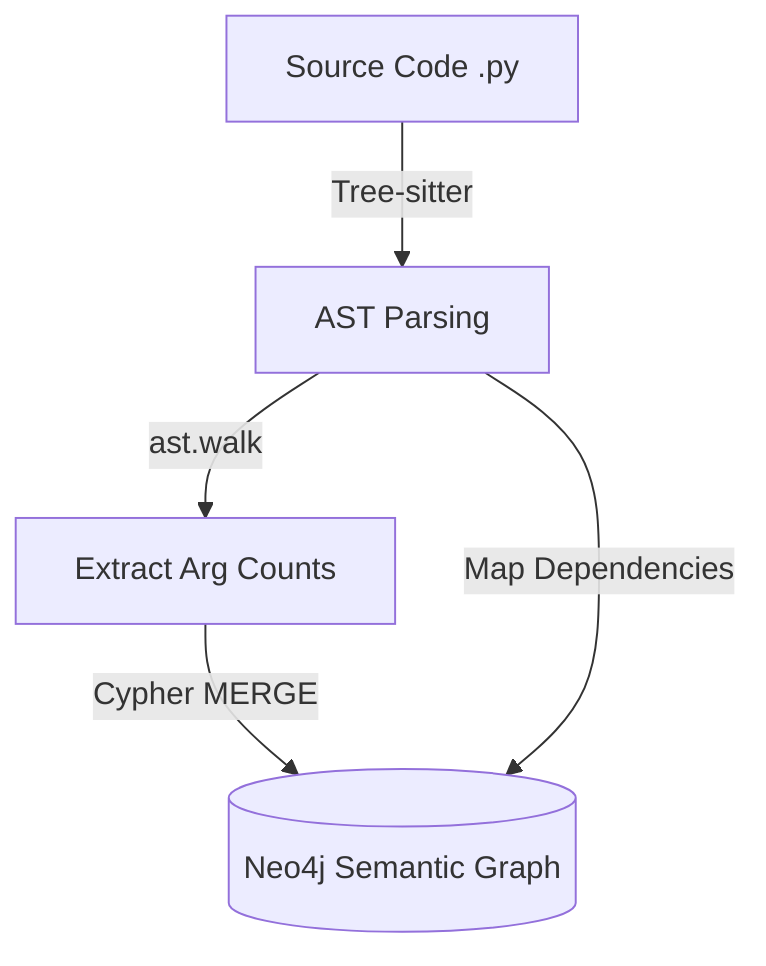
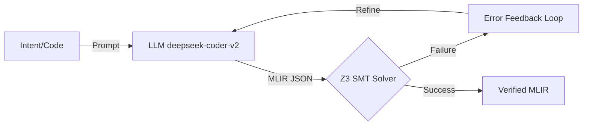
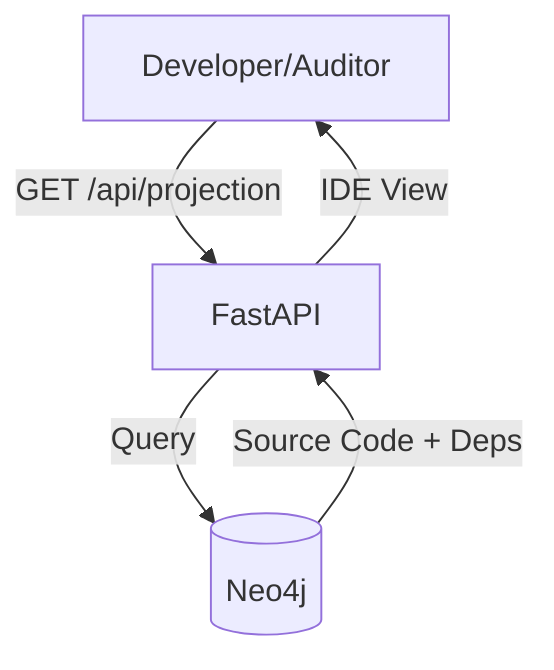
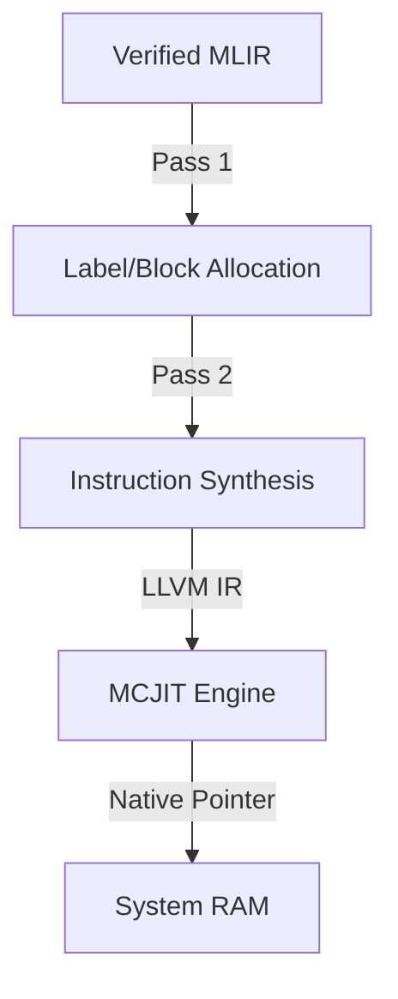
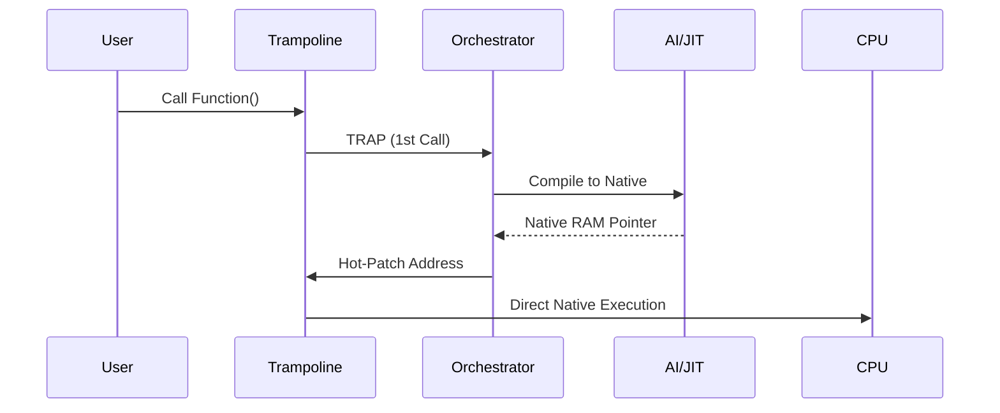
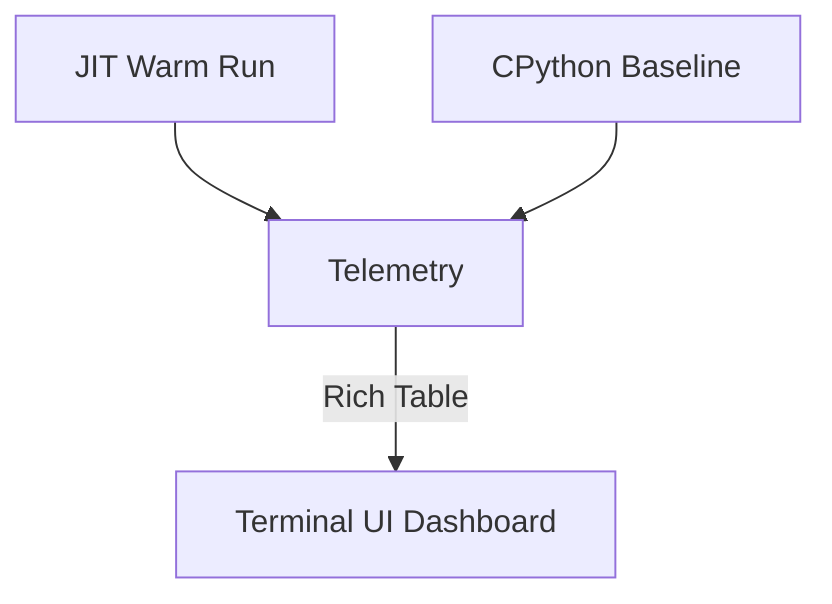
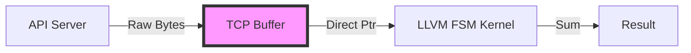
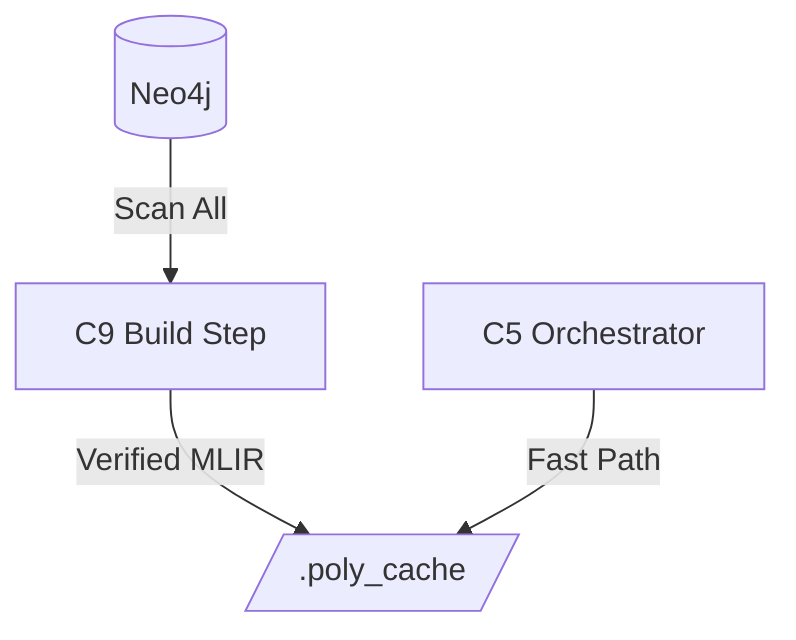
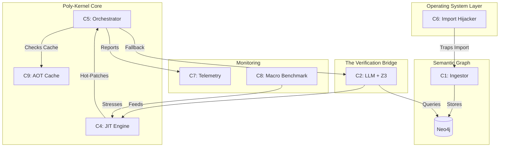

# DESIGN DOCUMENT: Repo OS Poly-Kernel (v1.0 - v2.5)

## 1. Architectural Vision
The goal of the Poly-Kernel is to decouple **Business Intent** (High-level Python) from **Hardware Execution** (Native Machine Code). It treats a source code repository not as a set of files, but as a **Semantic Graph** that can be dynamically "lowered" into verified silicon instructions on demand.

---

## 2. Component Breakdown & Diagrams

### [Component 1] The Generic Ingestor (Semantic Ground Truth)
**Functionality:** Performs AST parsing via Tree-sitter and extracts function signatures.

### [Component 2] The Formal Verification Bridge (SMT & LLM)
**Functionality:** AI translation of logic verified by mathematical safety proofs.

### [Component 3] The Semantic API (Human Visualizer)
**Functionality:** Translates complex machine state into human-readable business logic.

### [Component 4] The Persistent JIT Engine (The Synthesis Layer)
**Functionality:** A two-pass compiler synthesizing native machine code in RAM.

### [Component 5] The Trampoline Mesh (The Control Plane)
**Functionality:** Manages the function lifecycle and hot-patches memory addresses.

### [Component 6] The Import Hijacker (OS Layer)
**Functionality:** Overwrites the Python `import` mechanism to intercept code loading.

### [Component 7] Telemetry Dashboard (The Profiler)
**Functionality:** Real-time performance matrix visualization.

### [Component 8] Macro-Benchmark (Zero-Copy I/O)
**Functionality:** High-speed FSM scanner operating on raw TCP buffers.

### [Component 9] AOT Shadow Compiler (The Build Step)
**Functionality:** Background worker that pre-compiles the entire repo to disk.

---

## 3. System-Wide Integration Map

This diagram shows how all components work together to form the Zero-Binary pipeline.

## 4. Final System State
The Repo OS is now a **Universal AI-JIT**. It can take any "Legacy" Python repository, mathematically verify its business rules, and execute them as high-performance, zero-copy native kernels without the user ever writing a single line of C or LLVM.
