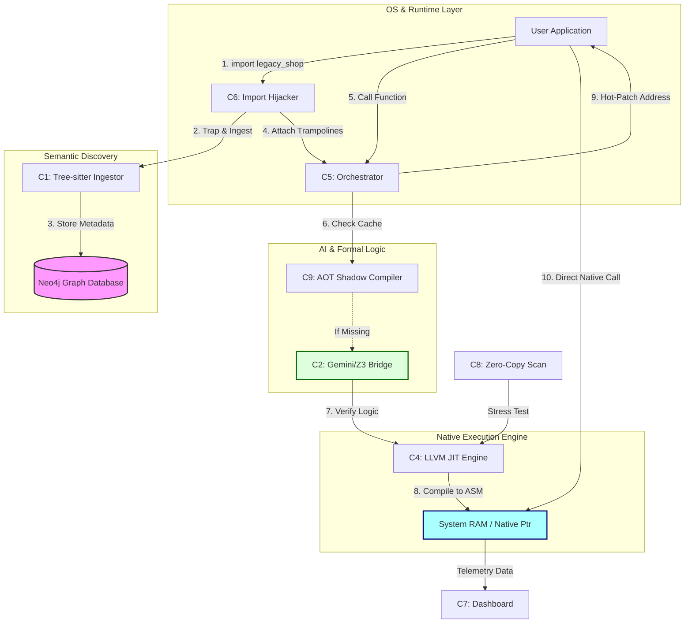

# Design Document: Repo OS Poly-Kernel Pipeline

## 1. Component Overview

| Component | Name | Primary Responsibility | Technical Stack |
| :--- | :--- | :--- | :--- |
| **C1** | **Generic Ingestor** | Parses Python source code into a semantic graph. Extracts AST structures, type hints, and data access patterns. | Tree-sitter, Neo4j, `ast` |
| **C2** | **Verification Bridge** | Translates Python logic into a safe Intermediate Representation (MLIR). Uses SMT solvers to prove memory safety and semantic correctness. | Gemini/DeepSeek, Z3 SMT, Pydantic |
| **C3** | **Semantic API** | Provides a human-readable projection of the internal machine state and code dependencies for auditing and visualization. | FastAPI, Neo4j |
| **C4** | **Persistent JIT Engine** | Synthesizes native machine code from verified MLIR. Performs memory mapping and instruction scheduling. | `llvmlite`, LLVM MCJIT, `ctypes` |
| **C5** | **Trampoline Orchestrator** | Manages the function lifecycle. intercepts calls, triggers background compilation, and hot-patches memory addresses for native execution. | Python `inspect`, `asyncio`, `ctypes` |
| **C6** | **Import Hijacker** | Intercepts the Python `import` system to automatically "kernel-ize" legacy repositories without code changes. | `sys.meta_path`, `importlib` |
| **C7** | **Telemetry Dashboard** | Profiles and compares performance between standard CPython and the Poly-Kernel JIT. | `rich`, `time` |
| **C8** | **Macro Benchmark** | Demonstrates high-performance, zero-copy I/O by scanning raw memory buffers using synthesized FSM kernels. | LLVM IR, `ctypes` |
| **C9** | **AOT Shadow Compiler** | Scans the Neo4j graph in the background to pre-verify and pre-compile functions to a disk cache, eliminating "cold start" latency. | Neo4j, Gemini, File System |

---

## 2. The Working Pipeline (Mermaid JS)

The following diagram illustrates the end-to-end flow from importing a legacy module to executing bare-metal machine code.

## 3. System Execution Flow

1.  **Ingestion:** When a module is imported, **C6** intercepts it and triggers **C1** to map the repository into **Neo4j**.
2.  **Trampolining:** **C5** wraps every function in the module with a "trap." The original Python code remains as a fallback.
3.  **Synthesis:** Upon the first call, **C5** requests a kernel. **C2** uses an LLM to generate an execution graph, which **Z3** verifies for memory safety (e.g., no buffer overflows).
4.  **Lowering:** **C4** takes the verified graph and generates LLVM IR, compiling it directly into a memory address.
5.  **Execution:** **C5** overwrites the function's internal pointer. Subsequent calls bypass the Python interpreter entirely, executing at native C speeds.
6.  **Optimization:** **C9** works in the background to ensure that for most calls, the "AI + Verification" step has already occurred, providing instant native performance.
